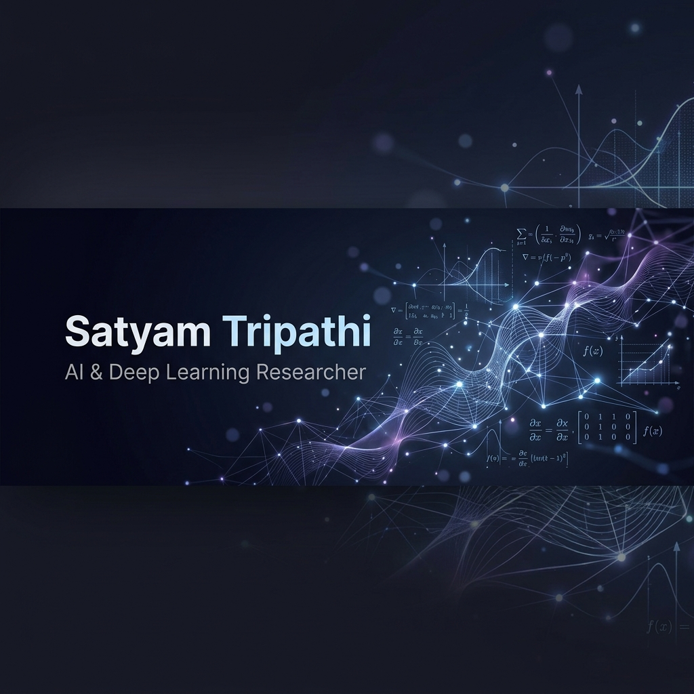

# Satyam Tripathi

  

I study artificial intelligence, focusing on natural language processing, explainable AI, and retrieval-augmented generation. Having recently completed my master's degree in CS & AI, I am looking for academic collaborations, research fellowships, and PhD opportunities to design advanced neural architectures.

---

### Research focus and background

* Interpretable retrieval: I work on making dense passage retrieval models transparent. My research focuses on token-weighting layers that let users adjust term importance at run time without retraining the base encoders.
* Faithful generation: I fine-tune open models to cite sources accurately. I use natural language inference models to measure and score generation faithfulness.
* Physics-guided machine learning: I am exploring how physical priors, like light spectrum distributions and subsurface scattering models, can improve synthetic media detection.

---

### Publications

* iDPR: A surprisingly simple step towards interpretable and interactive Dense Passage Retrieval (ARR submission #16835, under review for EMNLP 2026)
  * We created E5-WL, a lightweight token-weighting layer that allows real-time query correction and interactive word-importance tuning for dense embedding models on the fly.
* Foggy Weather Architecture: An Efficient IoT Data Management Policy (Published in ICCNT 2024)
  * Proposed a three-tier IoT fog computing framework that uses a tangential XOR-delta filter to reduce data management latency. We achieved a 21% reduction in wait time compared to baseline methods.
  * [Paper Link](https://ieeexplore.ieee.org/document/10725243)

---

### Featured projects

#### XRAG: Explainable RAG with Llama 8B
An agentic question-answering engine that cites its sources and runs verification loops.
* Architecture: Llama-3.1-8B generator (fine-tuned via LoRA), LangGraph agentic loop, FAISS hybrid search (lexical + dense RRF), and a DeBERTa NLI attribution model.
* Core idea: The system evaluates each generated sentence against cited sources. Claims that fail NLI validation are marked in red, while verified claims are marked in green. If the confidence score is too low, the LangGraph agent reformulates the query and retries up to three times.
* Results: The fine-tuned model achieved a 2.3x increase in citation F1 score over the raw base model.
* [Watch Demo](https://youtu.be/qa_a4fhMfS0) | [Code Repo](https://github.com/SKT799/XRAG-Explainable-RAG-Llama8B)

#### LoRA Fine-Tuning of Llama-3.1-8B
Fine-tuning recipe to teach open 8B models to cite sources.
* Method: Two-stage training using SFT followed by DPO. SFT teaches the model the inline citation format. DPO teaches the model to cite accurately by training it on pairs where the rejected completions have corrupted names, deleted citations, or misaligned sources.
* Results: Citation precision improved from 0.075 to 0.142 (~1.9x lift), and citation F1 score rose from 0.070 to 0.162 (~2.3x lift).
* [Watch Demo](https://youtu.be/SgtSzySUqgc) | [Code Repo](https://github.com/SKT799/LoRA-FineTuning-Llama-3.1-8B)

#### Knowledge Distillation for Dense Passage Retrieval
Distilling cross-encoder rankings into a lightweight bi-encoder.
* Method: Trained an `e5-base` bi-encoder (student) to copy the rankings of a `BGE-reranker-v2-m3` cross-encoder (teacher). The student is trained on a combined dataset of 793k queries from NQ and MS-MARCO using a combined KL-divergence and InfoNCE loss.
* Results: Replicated Microsoft's E5 paper on a single A100 GPU. The model reached **0.575 nDCG@10** on the BEIR NQ test split, matching within 1.5 points of the paper's original score (0.590).
* [Watch Demo](https://youtu.be/6PGuzEoUKyU) | [Code Repo](https://github.com/SKT799/Using-Knowledge-Distillation-For-Finetuning-Transformer-Based-Dense-Embedding-Model)

#### Multi-Agent Warehouse Routing (RL)
Multi-robot pathfinding in a pygame simulation.
* Method: Sequential tabular Q-learning with ε-greedy exploration. Robots learn a static 25x25 grid by trial and error, guided by step penalties (-1 per step) and collision penalties (-100 for walls, -50 for other home zones).
* Dynamic obstacle avoidance: Moving human obstacles are handled at run time with a sense-and-sidestep policy. Keeping these moving obstacles out of the Q-tables prevented training divergence.
* [Watch Demo](https://youtu.be/x0QCzsvAkkA) | [Code Repo](https://github.com/SKT799/Autonomous-Multi-Robot-Pathfinding-using-Reinforcement-Learning)

---

### Technical stack

* Programming languages: Python, C, Bash
* Deep learning & frameworks: PyTorch, TensorFlow, Transformers (Hugging Face PEFT/TRL), LangGraph
* Data & tooling: FAISS, NumPy, Pandas, FastAPI, Git, Pygame, LaTeX

---

### GitHub analytics

  

---

### Contact and links

* Email: [satyamkumartripathiofficial@gmail.com](mailto:satyamkumartripathiofficial@gmail.com)
* Profiles: [LinkedIn](https://www.linkedin.com/in/satyam-tripathi-6306a0225/) | [Hugging Face](https://huggingface.co/satyam2025) | [Kaggle](https://www.kaggle.com/satyamkumartripathi)
